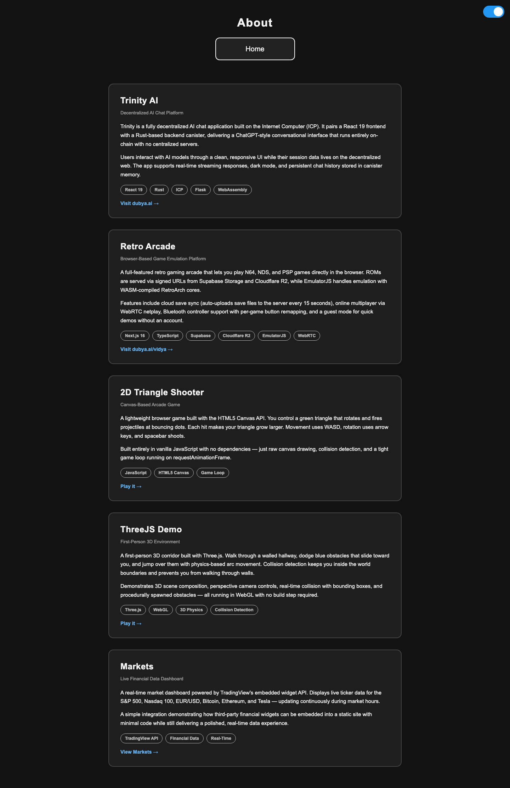

# Owen Heidenreich Portfolio Site

Static GitHub Pages portfolio for quick employer review links.

## Reviewer Summary

- **What it is:** personal portfolio site with project pages, experiments, blog content, and links to live demos.
- **Tech stack:** static HTML, CSS, and JavaScript.
- **Hosting target:** `https://owenheidenreich.github.io/`
- **Repository:** `owenheidenreich/owenheidenreich.github.io`

## Highlighted Project Links

| Project | Description | Live / Review Link |
|---|---|---|
| Trinity AI | Decentralized AI chat platform with React UI, ICP identity/canister work, Flask API, and Akash-hosted LLM inference. | https://dubya.ai |
| Retro Arcade / N64 Web Arcade | Browser-based game library with guest auth, Supabase, Cloudflare R2 signed URLs, EmulatorJS, and WebRTC/netplay experiments. | https://n64-arcade.vercel.app/vidya |
| Autoresearch Trading | SPX 0DTE options research system focused on data integrity, leakage prevention, replay validation, and experiment governance. | https://github.com/owenheidenreich/autoresearch-trading |
| LoopRunner | Android route planning and live run tracking app built with Expo and React Native. | https://github.com/owenheidenreich/looprunner |
| Bullet Parka Studio | Interactive Three.js fashion configurator for a sea-urchin-inspired parka. | https://github.com/owenheidenreich/sea-urchin-parka |

## Local Preview

Open `index.html` directly in a browser or serve the folder with any static web server.
